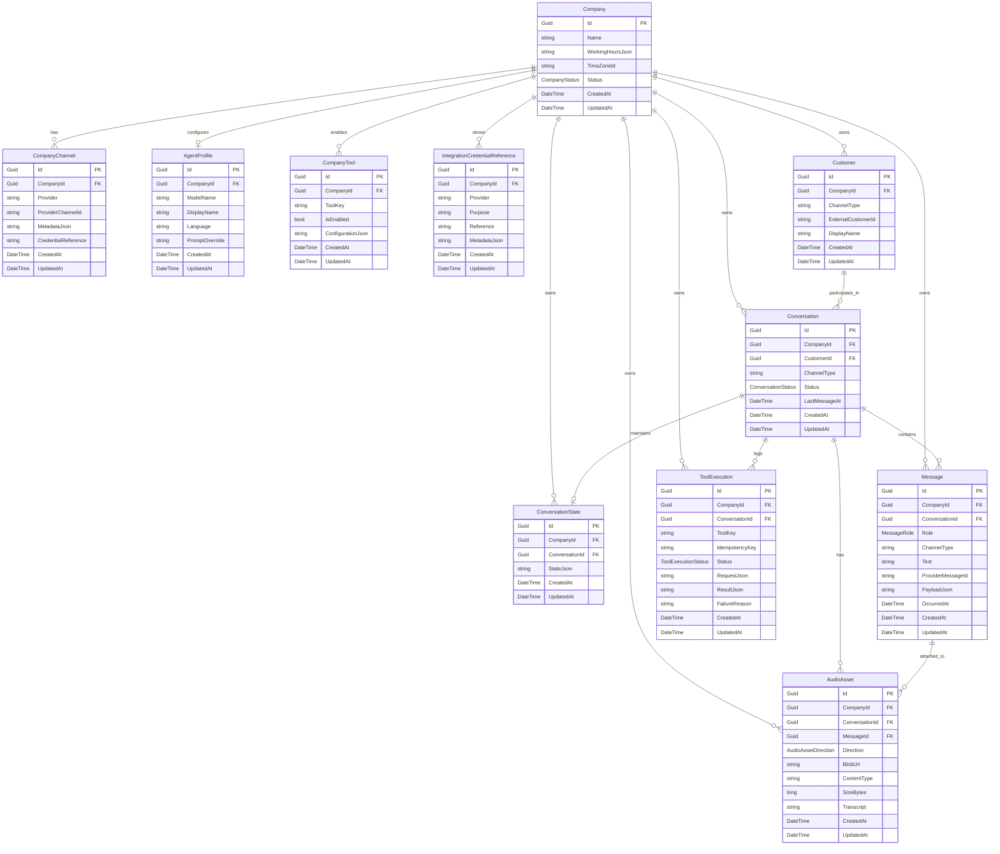

# Database Entity-Relationship Diagram

You can view this diagram or copy the raw Mermaid code to paste into Draw.io (Arrange > Insert > Advanced > Mermaid).

```mermaid
erDiagram
    %% Core Company Entities
    Company {
        Guid Id PK
        string Name
        string WorkingHoursJson
        string TimeZoneId
        CompanyStatus Status
        DateTime CreatedAt
        DateTime UpdatedAt
    }

    CompanyChannel {
        Guid Id PK
        Guid CompanyId FK
        string Provider
        string ProviderChannelId
        string MetadataJson
        string CredentialReference
        DateTime CreatedAt
        DateTime UpdatedAt
    }

    AgentProfile {
        Guid Id PK
        Guid CompanyId FK
        string ModelName
        string DisplayName
        string Language
        string PromptOverride
        DateTime CreatedAt
        DateTime UpdatedAt
    }

    CompanyTool {
        Guid Id PK
        Guid CompanyId FK
        string ToolKey
        bool IsEnabled
        string ConfigurationJson
        DateTime CreatedAt
        DateTime UpdatedAt
    }

    IntegrationCredentialReference {
        Guid Id PK
        Guid CompanyId FK
        string Provider
        string Purpose
        string Reference
        string MetadataJson
        DateTime CreatedAt
        DateTime UpdatedAt
    }

    %% Messaging and Interaction Entities
    Customer {
        Guid Id PK
        Guid CompanyId FK
        string ChannelType
        string ExternalCustomerId
        string DisplayName
        DateTime CreatedAt
        DateTime UpdatedAt
    }

    Conversation {
        Guid Id PK
        Guid CompanyId FK
        Guid CustomerId FK
        string ChannelType
        ConversationStatus Status
        DateTime LastMessageAt
        DateTime CreatedAt
        DateTime UpdatedAt
    }

    ConversationState {
        Guid Id PK
        Guid CompanyId FK
        Guid ConversationId FK
        string StateJson
        DateTime CreatedAt
        DateTime UpdatedAt
    }

    Message {
        Guid Id PK
        Guid CompanyId FK
        Guid ConversationId FK
        MessageRole Role
        string ChannelType
        string Text
        string ProviderMessageId
        string PayloadJson
        DateTime OccurredAt
        DateTime CreatedAt
        DateTime UpdatedAt
    }

    AudioAsset {
        Guid Id PK
        Guid CompanyId FK
        Guid ConversationId FK
        Guid MessageId FK
        AudioAssetDirection Direction
        string BlobUri
        string ContentType
        long SizeBytes
        string Transcript
        DateTime CreatedAt
        DateTime UpdatedAt
    }

    %% Business and AI Execution Entities
    ToolExecution {
        Guid Id PK
        Guid CompanyId FK
        Guid ConversationId FK
        string ToolKey
        string IdempotencyKey
        ToolExecutionStatus Status
        string RequestJson
        string ResultJson
        string FailureReason
        DateTime CreatedAt
        DateTime UpdatedAt
    }

    %% Company relations
    Company ||--o{ CompanyChannel : "has"
    Company ||--o| AgentProfile : "configures"
    Company ||--o{ CompanyTool : "enables"
    Company ||--o{ IntegrationCredentialReference : "stores"
    Company ||--o{ Customer : "owns"
    Company ||--o{ Conversation : "owns"
    Company ||--o{ ConversationState : "owns"
    Company ||--o{ Message : "owns"
    Company ||--o{ AudioAsset : "owns"
    Company ||--o{ ToolExecution : "owns"

    %% Customer and Conversation relations
    Customer ||--o{ Conversation : "participates_in"
    Conversation ||--o| ConversationState : "maintains"
    Conversation ||--o{ Message : "contains"
    Conversation ||--o{ AudioAsset : "has"
    Conversation ||--o{ ToolExecution : "logs"

    %% Message relations
    Message ||--o{ AudioAsset : "attached_to"
```
